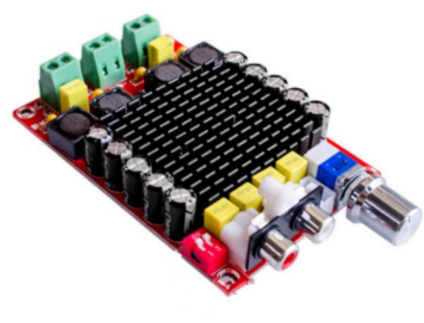
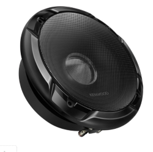
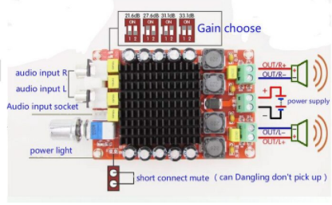

# Connection of sound systems

There are given different options of sound systems connection.

## Amplifier

Module, chosen for amplifier, is based on chip TDA7498:

Specification: 
- Input voltage: DC14-32V  
- Output power: 100W x 2  
- Output resistanse: 4-8Ohm  
- Lines type: D type 
- Chip: TDA7498  
- Harmonic ratio: PO = 1 Wt/0.05%  
- Frequency range: 18-100 kHz 
- Switching frequency: 360 kHz
- Signal/noise ratio: 110dB  
- Measures: 96x64x25mm  
- Output power: 100W + 100W (VCC+32V,RL=4Ohm,thd=10%) 
- Use of an differentiated input for noise reducing of common mode
- Has fault pattern and silent(noiseless) mode, intelligent protection features and overheaat protection function 

## Speakers

As a speakers there are used simple car speakers:

Specifications:  
- Rating (nominal) power: >50W  
- Max power: >300W  
- Frequency range: 50Hz-5kHz  
- Impendance: 4Ohm  

## General scheme of module conection

As a power supply there is used an ACDC source with specifications:  
- Output voltage: 24V  
- Power: at least 200W  

Considering, that declared power is generated at 32V, in our case (24V) amplifier power will not be 100W for a channel, it will be a bit lesser.

To connect an amplifier with output of audio devices, such as a phone, Raspberry Pi or sound card, it is nessesary to additionally buy cable-adapter minijack(m)-RCA(m):  

## Speakers connection options

We offer 3 options of speakers connection: 

!> To connect two speakers by _Option-1_, nominal power of every speaker should be more (not less), than 100W.

- **Option-1.** Two speakers are connected with an amplifier, each one is connected individually (separate channels). In that case, every speaker will be supplied with maximum power.
- **Option-2.** Two speakers are connected series to every channel. Under this scheme the power of the amplifier will fall twice as the total current sink resistance of the channel  will be 80hm, but not 40hm as it is declared.
- **Option-3.** Four speakers are connected series-parallel to every channel. It allows to take the maximum power from the amplifier and provide the maximum sound coverage.

