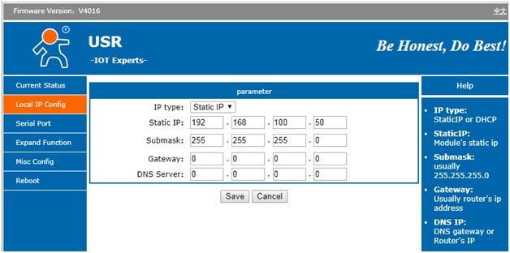
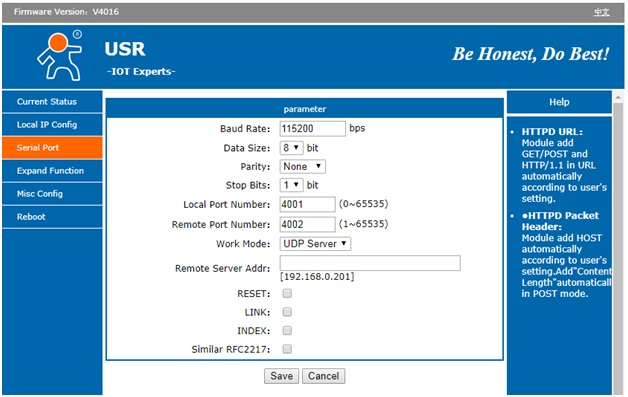

# USR-TCP232-302 setup guide

!> To use several converters in the same network without conflicts it is required to setup differrent IP-addresses. This guide assumes, that IP address of converter is _192.168.100.50_ (for example).

## Setup IP-address  
- plug PC (laptop) to the USR-SERIAL-SERVER  device directly using patch-coord with RJ45 connectors;  
- setup PC (laptop) temporarye IP-address to 192.168.0.1;  
- open web-browser and set host name:  
  - [http://192.168.0.7](http://192.168.0.7) (factory default IP)
  - User = admin  
  - Password = admin  
- go to the Local IP Config tab and set up as following (_192.168.100.50_ - IP-address for example):

| Parameter  | Value          |
|------------|----------------|
| IP type    | Static IP      |
| Static IP  | 192.168.100.50 |
| Submask    | 255.255.255.0  |
| Gateway    | 0.0.0.0        |
| DNS Server | 0.0.0.0        |

- press "save";  
- press "reboot/reset" in the page appeared after "save" action;  
- setup up IP-address of PC (laptop) to _192.168.100.2_ and reconnect to the device, but using new address: [http://192.168.100.50](http://192.168.100.50).

!> If the browser cannot connect to 192.168.0.7, set factory setup default of USR-TCP232: hold reset button pressed 5-10 seconds when powered on and then repeat previous chapter. Reset button is located near the power connector.

## Serial Port settings setup

Go to the Serial Port tab/page and setup it as follows, press "Save" then:

| Parameter          | Value      |
|--------------------|------------|
| Baud Rate          | 115200 bps |
| Data Size          | 8 bit      |
| Parity             | None       |
| Stop bits          | 1          |
| Local port number  | 4001       |
| Remote port number | 4002       |
| Work Mode          | UDP Server |
| Remote Server Addr |            |
| RESET              | no         |
| LINK               | no         |
| INDEX              | no         |
| RFC2217            | no         |

## Reboot

Press "Reboot" and confirm then.

## Notes

In order to plug serial server to [QUEEN BOARD](queen_board) take **UNUSUAL** modem COM-port cable DB9(m)-DB9(m):  

Cable pinout must be as following:

| DB9(m) pin | DB9(m) pin |
|------------|------------|
| 2          | 3          |
| 3          | 2          |
| 5          | 5          |

