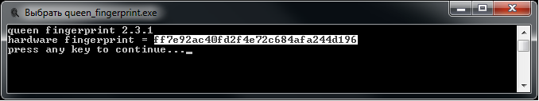
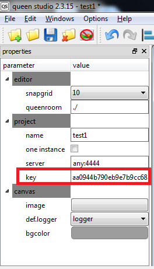

# QUEEN software activation

QUEEN software is distributed for free, except the game manager application _Queen Room_. Game manager has two builds: windows и raspberry pi. Without an activation _Queen Room_ application works in trial mode only 15 minutes; after that it shuts down with a "15 minutes time expired" error indication. You can see also trial mode indication in the _Queen Room_ window caption:  

When you purchase a **[QUEEN pack](queen_pack)** or software license, we activate _Queen Room_ application within one day. Follow this guide to do that...  

_Queen Room_ game manager is binded to the target hardware (PC/laptop motherboard or raspberry pi). The first thing you should do - to get a target hardware fingerprint, where the _Queen Room_ application will be running at. To implement this procedure run _queen\_fingerprint_ on the target hardware, you can download it from [QUEEN software page](queen_software). It has also builds both on windows and raspberry pi. _queen\_fingerprint_ shows a target hardware fingerprint as md5 hash code, for example:  

Copy this fingerprint _ff7e92ac40fd2f4e72c684afa244d196_ and send it to the QUEEN developers to Escape Room Doctor on e-mail dsi@escapedoc.com. Using your fingerprint we will generate an activation key in md5 format as well and send it as a e-mail reply. For example we generated the following key: _aa0944b790eb9e7b9cc68aa5b6e0b1be_.  

After receiving an activation key, open your queen project in the _Queen Studio_ editor and paste the key _aa0944b790eb9e7b9cc68aa5b6e0b1be_ in the "key" field of the properties window in the project block (it will appear when you left mouse click on the canvas):  

Save and copy your project to the target hardware and run it. Trial mode will disappear. You can find it, if the window caption will not include an indication like "trial version, 15 minutes operating limit", and the _Queen Room_ can be assumed activated for the lifetime further.  

