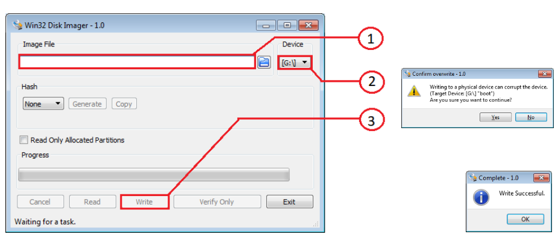
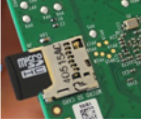

# QUEEN-RPi Raspberry Pi image install guide

## Preparing OS image

Download image queen-rpi.7z (link is below) and unzip it. Target file is queen-rpi.img:

:open_file_folder: [queen-rpi image](https://1drv.ms/u/s!Am_hkdn5bouShJV2uxeSw9EVuW7Nmw?e=h7sx6x)

## Preparing SD card

Insert your 8-32Gb SD-card in your laptop or PC card reader. Remember drive (volume) letter (i.e. D:, G: or H:).

## Win32DiskImager installation

This operation is committed once (if Win32DiskImager application was already installed, skip this step). Download application by the link below and install it:

:open_file_folder: [Win32DiskImager](https://1drv.ms/u/s!Am_hkdn5bouSg3MKm6d1RMvJx72P)

## Uploading OS image to the target SD-card

Set up Win32DiskImager application as following:  
1. Select image file queen-rpi.img.  
2. Select disk (volume) of SD-card (see p.2)  
3. Press "Write" button
4. Confirm (Yes) our action and wait operation successfuly finish "Write successful".



## Raspberry Pi SD card installation

Open explorer, make right mouse click on SD-card disk icon, select "Eject" from the context menu. Remove SD-card and install it to raspberry. SD-card must be oriented with contacts to the raspberry PCB (see the picture below).   



## Remote desktop installation

Image has a default IP network setup ith address _192.168.100.10_. Turn on raspberry after SD-card installation and wait within 1 minute for OS initializing. Plug raspberry to the ethernet network.
Attention! Master PC (laptop) must be in the same subnet as raspberry (_192.168.100.x_), for example, _192.168.100.2_. 
Download VNC viewer by the link below:

:open_file_folder: [VNC Viewer](https://1drv.ms/u/s!Am_hkdn5bouSg3VY2tIxuGJWQBJh)

Run it on your laptop or PC and create new connection (_File->New connection_):

- VNC Server: _192.168.100.10_ 
- Name: _192.168.100.10_
- Press "OK"  
- If dialog box "Identity Check. Duplicate VNC Server identity" is appeared, ignore it by pressing "Continue"  
- If dialog box "Unencrypted connection" is appeared, ignore it, setting check "Don’t warn me about this again on this computer" and press "Continue"  
- Press in the popup window: Username=pi, Password=raspberry  
- Set check "Remember password" and press "OK"  

## Expanding image size to the SD-card full capacity
Image size is approximately 5Gb, but the SD card has a bigger size (up to 32Gb). To allow OS use all SD-card capacity it is required to expand file system size. To implement this open console and enter the command:  

``` bash
sudo raspi-config
```

Implement the next steps:    
- open "Expand Filesystem" in the menu, then press "OK"
- select "Finish" (by pressing twice "tab" key) and then press "enter"
- "Would you like to reboot now?" - press "OK"
