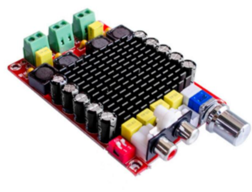
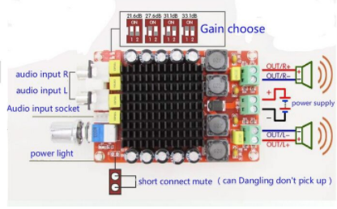

# Подключение звуковых систем

Здесь приводятся возможные варианты подключения звуковых систем.

## Усилитель

В качестве усилителя выбран модуль, основанный на чипе TDA7498:

Характеристики: 
- Входное напряжение: DC14-32V  
- Выходная мощность: 100W x 2  
- Выход сопротивление: 4-8Ohm  
- Тип линии: D тип 
- Чип: TDA7498  
- Коэффициент гармоник: PO = 1 Вт/0.05%  
- Диапазон воспроизводимых частот: 18-100 кГц  
- Частота переключения: 360 кГц  
- Отношение сигнал/шум: 110дб  
- Размер: 96x64x25mm  
- Выходная мощность: 100W + 100W (VCC+32V,RL=4Ohm,thd=10%)  
- Использование дифференцированного входа для снижения шума общего режима  
- Имеет бесшумный режим, интеллектуальные функции защиты и функция защиты от перегрева  

## Колонки

В качестве колонок используются обычные автомобильные колонки:

Характеристики: 
- Номинальная мощность: >50W  
- Максимальная мощность: >300W  
- Частотный диапазон: 50Hz-5kHz  
- Импеданс: 4Ohm  

## Общая схема подключения к модулю

Для питания каждого усилителя используется ACDC источник со следующими характиристиками:  
- Выходное напряжение: 24V  
- Мощность: не менее 200W  

Учитывая, что заявленная мощность вырабатывается при 32V, то в нашем случае (24V) мощность усилителя будет не 100W на канал, а немного меньше.  

Для подключения усилителя к выходу audio устройств, таких как телефон, Raspberry Pi или звуковая карта, дополнительно необходимо приобрести переходной-кабель minijack(m)-RCA(m):

## Варианты подключения колонок

Предлагается три варианта подключения колонок  

!> При подключении двух колонок, номинальная мощность каждой колонки должна быть не менее 100W

- **Вариант-1.** Две колонки подключаются к усилителю, причем каждая из них на отдельный канал. В этом случае на каждую колонку будет выдаться максимальная мощность.
- **Вариант-2.** По 2 колонки подключаются последовательно на каждый канал. При такой схеме мощность усилителя будет падать в два раза, так как суммарное сопротивление нагрузки на канал будет 8Ohm, а не 4Ohm, как заявлено.
- **Вариант-3.** По 4 колонки подключаются последовательно-параллельно на каждый канал. Это позволяет извлечь с усилителя максимальную мощность и обеспечить максимальное звуковое покрытие.  

