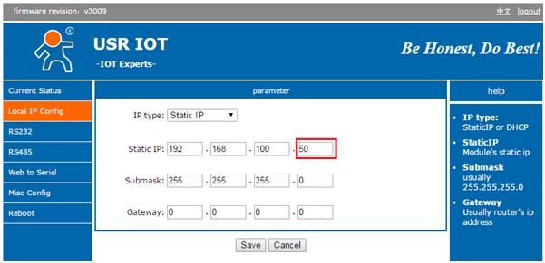
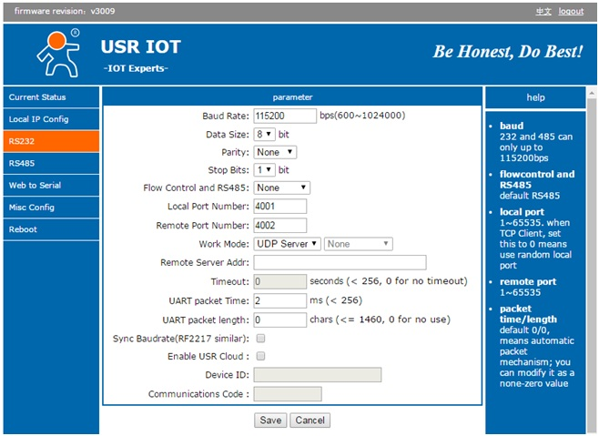
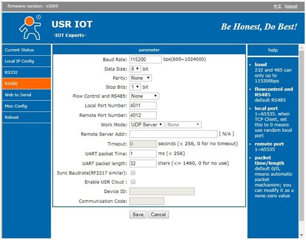

# Инструкция по настройке USR-TCP232-410S

!> На локации может быть несколько конвертеров и чтобы избежать конфликтов IP-адресов  необходимо их настраивать уникально (по умолчанию в инструкции он _192.168.100.50_).

## Установка IP-адреса 
- подключаем сервисный компьютер/ноутбук (далее service-pc) к  USR-SERIAL-SERVER напрямую патч-кордом rj45;
- устанавливаем временный IP адрес сервисного компьютера в _192.168.0.1_;
- открываем web-browser и в адресной строке вводим:  
  - [http://192.168.0.7](http://192.168.0.7)  
  - User = admin  
  - Password = admin  
- в появившемся окне переходим на вкладку Local IP Config и настраиваем все следующим образом (_192.168.100.50_ - IP-адрес для примера):

| Parameter  | Value          |
|------------|----------------|
| IP type    | Static IP      |
| Static IP  | 192.168.100.50 |
| Submask    | 255.255.255.0  |
| Gateway    | 0.0.0.0        |

- далее нажимаем "Save"
- в появившемся окне жмем "Reboot/Reset module";  
- устанавливаем IP адрес компьютера _192.168.100.2_ и пересоединяемся к устройству по адресу: [http://192.168.100.50](http://192.168.100.50).  

!> Если не удалось подключиться по адресу _192.168.0.7_, то необходимо вернуть настройки USR-TCP232 в заводские, для чего нажмите на утопленную кнопку рядом с разъемом питания и удерживайте секунд 5-10 при включенном питании, после чего повторите предыдущий пункт  

## Установка параметров RS232

Переходим на вкладку RS232 и настраиваем все следующим образом и нажимаем  "Save".

| Parameter              | Value      |
|------------------------|------------|
| Baud Rate              | 115200 bps |
| Data Size              | 8 bit      |
| Parity                 | None       |
| Stop bits              | 1          |
| Flow control and RS485 | None       |
| Local port number      | 4001       |
| Remote port number     | 4002       |
| Work Mode              | UDP Server |
| Remote Server Addr     |            |
| Timeout                | 0 seconds  |
| UART packet Time       | 2ms        |
| UART packet length     | 0          |
| SyncBaudrate           | no         |
| Enable USR Cloud       | no         |
| Device ID              |            |
| Communications Code    |            |

## Установка параметров RS485

Переходим на вкладку RS485 и настраиваем все следующим образом и нажимаем  "Save".

| Parameter              | Value      |
|------------------------|------------|
| Baud Rate              | 115200 bps |
| Data Size              | 8 bit      |
| Parity                 | None       |
| Stop bits              | 1          |
| Flow control and RS485 | None       |
| Local port number      | 4011       |
| Remote port number     | 4012       |
| Work Mode              | UDP Server |
| Remote Server Addr     |            |
| Timeout                | 0 seconds  |
| UART packet Time       | 1ms        |
| UART packet length     | 32         |
| SyncBaudrate           | no         |
| Enable USR Cloud       | no         |
| Device ID              |            |
| Communications Code    |            |

## Перезагрузка

Нажимаем на "Reboot" и подтверждаем.

## Примечания  

Для подключении [QUEEN BOARD](queen_board) необходимо воспользоваться обычным модемным кабелем COM-порта DB9(f)-DB9(m):

Распиновка кабеля должная быть прямой:

| DB9(f) pin | DB9(m) pin |
|------------|------------|
| 2          | 2          |
| 3          | 3          |
| 5          | 5          |

