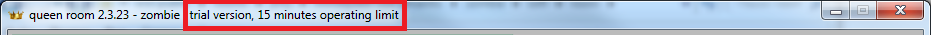
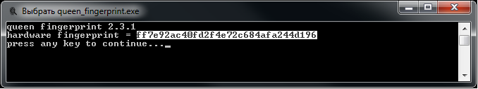
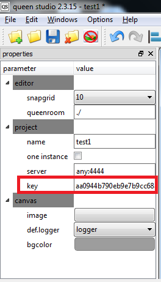

# Активация программного обеспечения QUEEN

Программное обеспечение QUEEN распространяется бесплатно за исключением программы гейм-менеджера _Queen Room_. Реализация этого модуля существует для ОС windows и raspberry pi. Без активации программа _Queen Room_ работает в trial режиме только 15 минут, после чего автоматически прекращает работу и индицирует сообщение об истечении trial периода. В trial режиме индикация появляется также в шапке окна:  

При покупке комплекта оборудования **[QUEEN pack](queen_pack)** или при покупке отдельной лицензии, мы активируем  _Queen Room_ в течение одного дня. Для этого следуйте следующий инструкции...

Гейм-менеджер _Queen Room_ осуществляет привязку к конечной аппаратной платформе (материнской плате компьютера или raspberry pi). Для получения ключа активации необходимо снять отпечаток железа, на котором будет запущена программа **queen room**. Для этого необходимо запустить на целевом железе программу _queen\_fingerprint_, которая входит в [программное обеспечение QUEEN](queen_software) и имеет релиз под Windows и Raspberry Pi. При запуске _queen\_fingerprint_ программа предоставит отпечаток целевого железа; этот отпечаток представляет собой хэш сумму md5, например:

Этот отпечаток _ff7e92ac40fd2f4e72c684afa244d196_ необходимо скопировать и отправить разработчикам QUEEN в Escape Room Doctor на e-mail dsi@escapedoc.com. Мы на основании этого отпечатка сформируем ключ также в формате хэш суммы md5 и отправим вам обратно. Допустим получился следующий ключ: _aa0944b790eb9e7b9cc68aa5b6e0b1be_.  

Далее необходимо открыть проект в программе редакторе _Queen Studio_ и вставить высланный нами ключ _aa0944b790eb9e7b9cc68aa5b6e0b1be_ в поле "key", окна "Properties" раздела "project" (появится при клике на холст):  

После этого нужно скопировать проект на целевое железо и запустить. Trial режим должен пропасть, о чем будет свидетельствовать пропадание надписи "trial version, 15 minutes operating limit". После чего программа считается активированной.  

