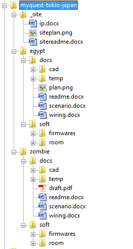

# Рекомендации по организации файловой структуры проектов

Целью данного документа является создание рекомендаций для ведения единой системы файлов проектов.
Файловое хранилище для каждой локации находится в отдельной папке в облаке OneDrive в формате _названиефирмы-страна-город_, например, _cubirint-russia-moscow_.
Каждая такая папка содержит документацию, схемы, карты IP-адресов, прошивки микроконтроллеров, программное обеспечение и т.п.
Далее речь пойдет о структуре одной такой папки для некоторой отдельно взятой локации. Под локацией понимается арендованное помещение, в котором может быть несколько квестов.  

Далее в рамках локации создаются папки для каждого квеста, причем имена этих папок задаются в соответствии с именами квестов.
Также создается папка _#site_, в которой содержатся общие файлы для этой локации, а не для конкретного квеста, например данные о кабельных трассах в коридорах, таблицы IP-адресов, устройства в комнате гейм мастера и т.д.

!> Имена файлов и папок не должны содержать русских символов и пробелов, а также желательно не использовать заглавные буквы, т.е. используем только латиницу в нижнем регистре, цифры и нижнее подчеркивание в качестве разделителя!

## Общие файлы локации (#site)

В папке должны содержаться следующие файлы:  
- **siteplan.pdf** (или .png) - общий план локации с обозначением комнаты гейммастера, всех квестов, а также места вывода 220/110В розеток и обозначения прочих кабельных трасс, которые касаются локации в целом;  
- **sitereadme.docx** - общий файл с обозначениями, требованиями и рекоммендациями;  
- **ip.docx** - карта IP адресов, используемых в различных квестах; предполагается, что все квесты находятся в одной подсети;  

## Файловая структура отдельного квеста

В папке для конкретного квеста должны содержаться две подпапки: _docs_ - папка с документацией и _soft_ - папка с программным обеспечением.

## Документация квеста (docs)

В папке _docs_ должны содержаться следующие папки и файлы:  
- **readme.docx** - общий файл с обозначениями, требованиями и рекоммендациями;  
- **draft.pdf** - многостраничный проект квеста (опционально);  
- **plan.png** - план квеста с размещением устройств: в некоторых случаях, когда целый проект не делается и достаточно только плана квеста со схематичным размещением всех электронных устройств, то в этом случае вместо объемного проекта draft.pdf выпускается один файл plan.png;  
- **wiring.docx** - кабельный журнал квеста;  
- **scenario.docx** - файл, описывающий сценарий игрового процесса (gameflow), необходимый для программирования сценария;  
- **cad** - папка содержащая исходные документы проекта в исходном dwg формате (опционально).  

!> Если в результате работы образуются случайные или временные файлы (в рабочем процессе такое бывает), то не нужно их складировать в папку docs, устраивая помойку. Для этих целей предусмотрим внутри doc папку temp, в которую будем складировать временные файлы, а сама структура doc должна быть именно такой, как описано выше! 

## Программное обеспечение квеста (soft)

В папке _docs_ должны содержаться следующие папки и файлы:  
- **firmwares** - папка с прошивками всех микроконтроллеров, использующихся в квесте;  
- **room** - папка с проектом комнаты на _queen_, содержащая сам проект, программы _Queen Studio_ и _Queen Room_, а также набор библиотек; в общем в _room_ должен быть рабочий актуальный дистрибутив, который можно всегда в случае чего установить на локации в качестве программы управления квестом;  

## Пример организации файлов

Предположим, есть вымышленная квестовая кампания "MyQuest" в городе "Tokio", в котором имеются два квеста: zombie и egypt.
В хранилище проектов создается папка _myquest-tokio-japan_. А файловая структура будет выглядеть следующим образом:  

