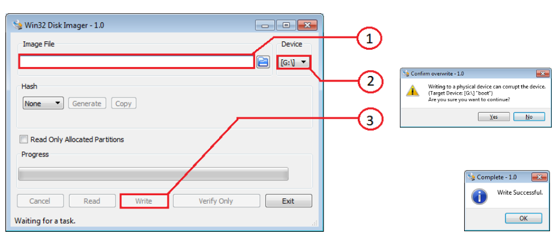
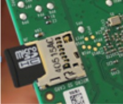

# Установка образа queen-rpi на Raspberry Pi

## Подготовка образа операционной системы

Скачиваем образ queen-rpi.7z (ссылка ниже) и распаковываем, в результате чего получается файл queen-rpi.img:

:open_file_folder: [queen-rpi image](https://1drv.ms/u/s!Am_hkdn5bouShJV2uxeSw9EVuW7Nmw?e=h7sx6x)

## Подготовка SD-карты

Необходимо вставить в ноутбук (ПК) SD-карту объемом от 8Гб до 32Гб, понять какая буква диска присвоена SD-карте (например, диск D:, G: или H).

**Установка Win32DiskImager**  
Делается единожды, поэтому, если программа уже установлена ранее на данном ноутбуке (ПК), то пропускаем этот пункт. Скачиваем программу по ссылке и устанавливаем на компьютер:

[Win32DiskImager](https://1drv.ms/u/s!Am_hkdn5bouSg3MKm6d1RMvJx72P)

## Заливка образа операционной системы на SD-карту

Настраиваем Win32DiskImager как показано ниже на рисунке:  
1. Выбираем файл образа queen-rpi.img  
2. Выбираем диск, где расположена SD-карта (см. п. 2)  
3. Нажимаем на кнопку "Write" 
4. Далее подтверждаем "Yes" и ждем сообщения "Write successful". Если так, то переходим далее



## Установка SD карты в raspberry

Далее заходим в "Мой компьютер", правой кнопкой по диску с SD-картой, в появившемся меню выбираем "Извлечь" ("Eject"); извлекаем SD-карту и устанавливаем в raspberry. SD-карта вставляется рисунком/надписями от Raspberry, таким образом, чтобы контактные площадки были направлены к Raspberry:  



## Установка удаленного рабочего стола

По умолчанию у raspberry pi IP-адрес: _192.168.100.10_. Устанавливаем SD-карту в raspberry, подключаем raspberry к сети и включаем raspberry. Ждем минуту, пока загрузится.  
Важно! Необходимо, чтобы компьютер (ноутбук) находился в той же подсети (_192.168.100.x_), что и raspberry, для этого на компьютере необходимо установить второй IP-адрес статический, например, _192.168.100.2_.  
Далее нужно скопировать программу VNC viewer по ссылке ниже

:open_file_folder: [VNC Viewer](https://1drv.ms/u/s!Am_hkdn5bouSg3VY2tIxuGJWQBJh)

Запустить и создать новое подключение _File->New connection_:  
- VNC Server: _192.168.100.10_
- Name: _192.168.100.10_ 
- Нажать "OK"  
- Если появится окно "Identity Check. Duplicate VNC Server identity", игнорируем его, нажав "Continue" 
- Если появится окно "Unencrypted connection", игнорируем его, установив галочку "Don’t warn me about this again on this computer" и нажав "Continue"  
- В появившемся окне Username=pi, Password=raspberry  
- Ставим галочку "Remember password" и жмем "OK"  


## Расширение размера диска файловой системы до размера SD-карты

Это нужно, поскольку сам образ имеет размер 5Gb, а SD-карта по факту может быть все 32. Чтобы использовать весь размер карты необходимо выполнить этот пункт. Открываем консоль (см.скриншот ниже). В появившейся консоли набираем команду:

``` bash
sudo raspi-config
```

В появившемся меню выбираем пункт "Expand Filesystem" и далее в появившемся окне нажать "OK", выбрать "Finish", два раза нажав, на "Tab" и затем "Enter"; далее в появившемся окне "Would you like to reboot now" выбрать "OK" и дождаться результата перезагрузки.
Теперь размер файловой системы расширен до размера SD-карты
