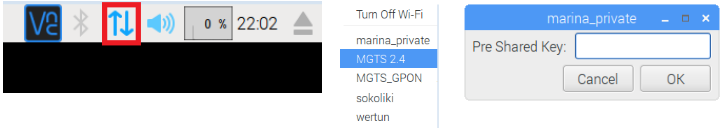

# Установка сетевых параметров на Raspberry Pi

!> На локации может быть несколько Raspberry Pi и чтобы избежать конфликта IP-адресов,  необходимо их настраивать правильно, по умолчанию IP адрес - _192.168.100.10_

## Установка Wi-Fi (необязательно)

Реализация осуществляется при помощи графического интерфейса, т.е. при подключении к Raspberry Pi монитора клавиатуры и мыши или при помощи удаленного рабочего стола (VNC).
В правом верхнем углу кликаем левой кнопкой мыши по значку "сеть" (иконка как правило выглядит как "стрелочки" - см.рисунок.ниже). В выпадающем списке выбираем имя сети WiFi, кликаем левой кнопкой мыши, а в появившемся окне вводим ключ к сети:



## Настройка сети Ethernet

Открываем командную строку (консоль) через GUI и вводим команду:

``` bash
sudo nano /etc/dhcpcd.conf
```

Откроется консольный блокнот, переходим в самый конец файла и находим строки:

```
interface eth0    
static ip_address=192.168.100.10/24
```

_192.168.100.10_ - это IP-адрес raspberry pi по умолчанию: его нужно изменить на новый IP в диапазоне от _192.168.100.11_ - _192.168.100.49_ (т.е. поменять только последнее число). IP-адрес должен быть уникальным в рамках локальной сети. После изменения IP-адреса выходим из блокнота, сохранив файл (ctrl-x + y + enter), и перезагружаем raspberry pi:

``` bash
sudo reboot
```

## Проверка

После перезагрузки необходимо заново открыть подключение по удаленному рабочему столу, но поскольку IP-адрес изменился, то необходимо откорректировать параметры подключения:  
- Правой кнопкой мыши по подключению, выбираем "Properties…"  
- В полях VNC Server и Name забиваем новый IP-адрес, такой же какой настроили на raspberry  
- Жмем "ОК" 
Если подключение прошло успешно, то задача выполнена.
