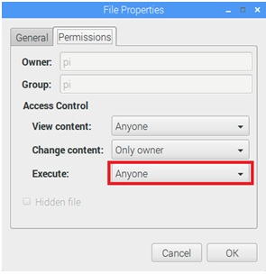

# Установка программного обеспечения на Raspberry Pi

!> Перед установкой принимается, что IP-адрес raspberry pi - _192.168.100.10_, если адрес другой, то необходимо везде по ходу инструкции менять его на нужный

## Установка программы управления комнатой

Для установки ПО используется программа XFTP (инструкция по установки приводится ниже):

:page_facing_up: [Установка FTP и SSH клиентов для Raspberry Pi](rpi_ftp_ssh_setup)

Необходимо открыть XFTP и установить соединение с нужным Raspberry Pi. Далее нужно скопировать проект в папку _/home/pi/queen_. Если папка не создана, то нужно её создать, а затем скопировать туда _queen\_room_ и необходимый для запуска проект. В результате в папке _/home/pi/queen_ должно быть следующее содержимое:  

- /macroeffects
- /media
- /scenarios
- room.xml
- queen_room

Далее необходимо запустить _queen_room_. Но перед этим нужно убедиться, что queen_room имеет права на исполнение (execution), и если нет, то установить их (п.2).

## Установка прав на запуск программы queen_room

При копировании исполняемых файлов (напр. _queen\_room_ или _queen\_tv_) необходимо установить атрибуты файлов для возможности их запуска. Для этого нужно правой кнопкой мыши кликнуть по файлу и в меню выбрать "Properties". Перейти на вкладку "Permissions" открывшегося диалога "File properties" и установить Execute = Anyone, затем нажать "Enter":  

