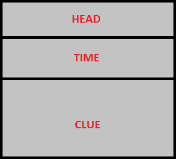
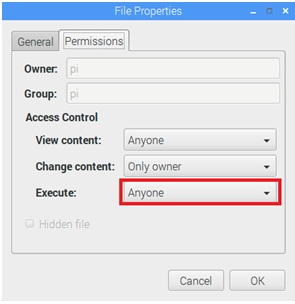

# Средство управления экранами Queen TV

В состав системы QUEEN входит специальная программа _Queen TV_, разработанная под Windows и Raspberry Pi 3 и распространяемая бесплатно.  

## Перечень оборудования

| Устройство               |                         Фото                          | Комментарии                           |
|--------------------------|:-----------------------------------------------------:|---------------------------------------|
| 1. Сетевой фильтр        |     |                                       |
| 2. Процессорный модуль   |                                                       |                                       |
| 2.1. Raspberry Pi        |  | модель: Raspberry Pi 3 model B или B+ |
| 2.2. Micro-SD карта      |          | SD-карта для RPI, class 10, 8-32GB    |
| 2.3. RPI адаптер питания |    | 5.1V, 2.5A                            |
| 3. Экран                 |              | Экран должен иметь HDMI-интерфейс     |

## Общие сведения

Компьютер с _Queen TV_ подключается с дисплею и интегрируется с гейм-менеджером _Queen Room_ посредством локальной вычислительной сети LAN по Wi-Fi/Ethernet.

Компонент _Queen TV_ позволяет:  
- проигрывать видеофайлы с возможностью зацикливания;  
- устанавливать картинку / заставку / заданный цвет фона;  
- отображать таймер хода игры;  
- показывать подсказки в виде печатного текста;  

Структура экрана _Queen TV_:  

- **HEAD** - место для заголовка (например логотипа компании или названия квеста);  
- **TIME** - место для таймера;  
- **CLUE** - место для подсказки.

Программа _Queen TV_ может находится в двух взаимоисключающих состояниях: проигрывания видео на весь экран (видеорежим) или в состоянии отображения текстового контента (текстовый режим).

## Установка Queen TV

Необходимо подготовить Raspberry Pi. Для этого сначала нужно загрузить операционную систему, используя [инструкцию по заливке образа](rpi_image_upload), а затем установить нужный IP адрес сети, используя [эту инструкцию](rpi_ip_setup). После этого следует скопировать в папку _/home/pi/queen_ последнюю версию программы _queen\_tv_, используя [инструкцию по загрузке программ](rpi_soft_install). Также требуется загрузить необходимы видео и изображения.

Далее необходимо установить атрибут файла _queen\_tv_ для возможности запуска. Для этого нужно правой кнопкой мыши кликнуть по файлу и в меню выбрать "Properties". Перейти на вкладку "Permissions" открывшегося диалога "File properties" и установить Execute = Anyone, затем нажать "Enter":  

 

Для проигрывания видео создайте в _Queen Studio_ компонент типа "adapter" и установите у него hwtype=tv, а в качестве IP адреса нужно указать IP адрес raspberry, на котором будет запущен queen\_tv, port=4466. Далее, запустив _Queen Room_, нужно убедиться, что связь с _Queen TV_ установилась (адаптер стал зеленым), и двойным кликом вызвать меню, зайти в подменю "play" и выбрать нужный файл для проигрывания (видео файлы файлы должны быть скопированы заранее и формат должен быть совместимым - смотрите в конце статьи информацию об этом).

## Команды Queen TV

Некоторые команды, такие как проиграть видео или дать подсказку можно выпонлить в ручном режиме из интерфейса гейммастера в _Queen Room_, но в действительности список команд управления намного больше и он задается через макроэффекты. Для этого необходимо в макроэффекта выбрать действие _send_, выбрать adapter, который связан с queen_tv и ввести любую из следующих команд (ключевые слова выделены жирным):

### Работа с видео
| Команда                                 | Описание                                                                  |
|-----------------------------------------|---------------------------------------------------------------------------|
| **play** "video.avi"                    | перейти в видео режим и проиграть файл video.avi                          |
| **play**&nbsp;"video.avi"&nbsp;**loop** | перейти в видео режим и проиграть файл video.avi и зациклить проигрывание |
| **stop**                                | выйти из в видео режима и остановить проигрывание файла                   |
| **pause**                               | поставить проигрывание файла на паузу                                     |  

Также программа выходит из видео режима автоматически после окончания проигрывания видеофайла, если не указан флаг зацикливания.  

### Работа с контентом
| Команда                                   | Описание                                                                                                                                                                                                                                                                                             |
|-------------------------------------------|------------------------------------------------------------------------------------------------------------------------------------------------------------------------------------------------------------------------------------------------------------------------------------------------------|
| **head** "text"                           | вывести text в зоне заголовка HEAD                                                                                                                                                                                                                                                                   |
| **time** on                               | показать оставшееся время квеста в зоне таймера TIME                                                                                                                                                                                                                                                 |
| **time** off                              | скрыть оставшееся время квеста в зоне таймера TIME                                                                                                                                                                                                                                                   |
| **clue** "text"                           | вывести text в зону подсказок CLUE                                                                                                                                                                                                                                                                   |
| **clue** "text" **typing**                | вывести text в зону подсказок CLUE побуквенно                                                                                                                                                                                                                                                        |
| **clue** "text" **typingfx**              | вывести text в зону подсказок CLUE побуквенно со звуком печатающей машинки                                                                                                                                                                                                                           |
| **textcolor** newcolor                    | установить цвет newcolor во всех зонах (HEAD,TIME,CLUE), причем newcolor может быть как человечески понятным, например, red, green, yellow, и т.д., так и выраженный в HEX-формате RGB, начиная с символа #, так же как в CSS, например #ff0000 - красный, #00ff00 - зеленый, #ffffff - белый и т.д. |
| **headcolor** newcolor                    | установить цвет newcolor в зоне заголовка HEAD, формат newcolor см.выше                                                                                                                                                                                                                              |
| **timecolor** newcolor                    | установить цвет newcolor в зоне таймера TIME, формат newcolor см.выше                                                                                                                                                                                                                                |
| **cluecolor** newcolor                    | установить цвет newcolor в зоне подсказок CLUE, формат newcolor см.выше                                                                                                                                                                                                                              |
| **color** newcolor                        | установить цвет newcolor в качестве фона, формат newcolor см.выше                                                                                                                                                                                                                                    |
| **textsize** size                         | установить размер текста size во всех зонах (HEAD,TIME,CLUE), size - это число от 1 до 72                                                                                                                                                                                                            |
| **headsize** size                         | установить размер текста size в зоне заголовка HEAD, формат size см.выше                                                                                                                                                                                                                             |
| **timesize** size                         | установить размер текста size в зоне таймера TIME, формат size см.выше                                                                                                                                                                                                                               |
| **cluesize** size                         | установить размер текста size в зоне подсказок CLUE, формат size см.выше                                                                                                                                                                                                                             |
| **font** "newfont"                        | установить шрифт текста font во всех зонах (HEAD,TIME,CLUE), newfont - это семейство шрифта, например, "Arial", "Times New Roman", "Corier New" и т.д.                                                                                                                                               |
| **image** "bg.png"                        | установить картинку backgroud.png в качестве фона, разместив ее относительно левого верхнего угла                                                                                                                                                                                                    |
| **image**&nbsp;"bg.png"&nbsp;**stretch**  | установить картинку backgroud.png в качестве фона, растянув ее по всей площади экрана                                                                                                                                                                                                                |

!> 1. В командах, где это указано, необходимо использовать именно двойные кавычки, а не одинарные.  

!> 2. В команде image используйте только PNG файлы (jpg не поддерживается).  

!> 3. Для Raspberry Pi: при проигрывании видео файлов поток пишется напрямую в видеопамять для ускорения процесса, поэтому его не будет видно через удаленный рабочий стол VNC, хотя на телевизоре через HDMI все будет проигрываться нормально.  

!> 4. Для Raspberry Pi: мы рекоммендуем проигрывать видео только в формате MP4 с кодеком H.264.  

!> 5. Для Windows: мы рекоммендуем устанавливать последнюю версию K-Lite Codec Pack при использовании queen tv.

!> 6. Для Windows: обнаружена проблема: в некоторых случаях видео даже при установленных кодеках не проигрывается, есть временное решение - это установить библиотеку [Qt](https://1drv.ms/u/s!Am_hkdn5bouSgp5ygnMihG-atZ9zvQ) в C:/qt/4.7.4/bin, удалить все dll из папки с Queen TV, прописать в системный Path этот путь C:/qt/4.7.4/bin, после чего нужно перезагрузить компьютер и все будет работать. В ближайшее время мы устраним этот issue и релиз queen будет включать "в коробке" все необходимы компоненты без внешних библиотек и зависимостей.  

