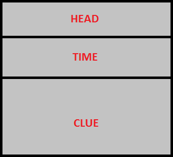

# Display content manager - Queen TV 

QUEEN contains the special application _Queen TV_ allows controlling display content. This application has a built for Microsoft Windows and Raspberry Pi, it is distributed for free.  

## Devices list

| Device                |                       Photo                        | Comments                                  |
|-----------------------|:--------------------------------------------------:|-------------------------------------------|
| 1. Power strip        |     |                                           |
| 2. Processor module   |                                                    |                                           |
| 2.1. Raspberry Pi     |  | exact model: Raspberry Pi 3 model B or B+ |
| 2.2. Micro-SD card    |          | class 10, 8-32GB                          |
| 2.3. RPI power supply |    | 5.1V, 2.5A                                |
| 3. Display            |              | Display must have a HDMI-interface        |

## Common information

Laptop/PC or Raspberry Pi with _Queen TV_ must be connected to the target display, and it is integrated with _Queen Room_ game manager via LAN (Wi-Fi/Ethernet).

Application _Queen TV_ features:  
- playing video files with an opportunity of loop;  
- set background image or color;  
- show current countdown timer;  
- show clues;  

_Queen TV_ screen layout:

- **HEAD** - place for header (can be used escape room name);  
- **TIME** - place for timer;  
- **CLUE** - place for clues. 

Application _Queen TV_ has two possible mutual states: fullscreen video mode and text content mode.

## Installing Queen TV

To prepare Raspberry Pi, first [upload OS image](rpi_image_upload), and then setup an IP address, using **[this guide](rpi_ip_setup)**. After that, copy the last _queen\_tv_ version to the folder _/home/pi/queen_, using **[this upload guide](rpi_soft_install)**. Also, you are need upload necessary video and pictures.

After, you should set a _queen\_tv_ executable attributes to make an opportunity of run this file. To implement this make a right mouse click on the target file and select "Properties" in the popup menu. Select "Permissions" tab in the "File properties" dialog and make an Execute = Anyone, press enter then:  

To implement a test, create an adapter component in the _Queen Studio_, set property hwtype=tv, and specify a Raspberry IP address, where Queen TV is running, port=4466. Start queen room and be sure the connection with Queen TV is established (adapter becomes green), double left-click on the adapter, then submenu "play"  and choose file to play from the list (files should be copied in advance and the format must be compatible - see at the bottom of the document).  

## Queen TV commands

Several commands, like play video or give a clue can be committed manually from the game master interface in _Queen Room_ application, but full command list has more flexible functionality and can be implemented using macroeffects. To implement commands create a macroeefect action, select _send_ type, then choose a target "tv" adapter, and you can specify any of the command below (keywords are marked with bold):  

### Operations with video

| **Command**                             | **Description**                                     |
|-----------------------------------------|-----------------------------------------------------|
| **play** "video.avi"                    | go to the video mode and play video.avi             |
| **play**&nbsp;"video.avi"&nbsp;**loop** | go to the video mode and play video.avi with loop   |
| **stop**                                | return from the video mode to the text content mode |
| **pause**                               | pause video                                         |  

Application returns from video automatically after it finishes playing file if loop is not specified.  

### Operations with content

| Command                                  | Description                                                                                                                                                                                                                                                 |
|------------------------------------------|-------------------------------------------------------------------------------------------------------------------------------------------------------------------------------------------------------------------------------------------------------------|
| **head** "text"                          | show text in the HEAD zone                                                                                                                                                                                                                                  |
| **head** off                             | hide text in the HEAD zone                                                                                                                                                                                                                                  |
| **time** on                              | show timer in the TIME zone                                                                                                                                                                                                                                 |
| **time** off                             | hide timer in the TIME zone                                                                                                                                                                                                                                 |
| **clue** "text"                          | show text in the CLUE zone                                                                                                                                                                                                                                  |
| **clue** "text" **typing**               | show text in the CLUE zone slowly (symbol-by-symbol)                                                                                                                                                                                                        |
| **clue** "text" **typingfx**             | show text in the CLUE zone slowly (symbol-by-symbol) with a printing sound effect                                                                                                                                                                           |
| **clue** off                             | hide text in the CLUE zone                                                                                                                                                                                                                                  |
| **textcolor** newcolor                   | set color as newcolor in all of zones (HEAD,TIME,CLUE), newcolor can be either human-readable like, red, green, yellow, etc., or in the HEX-format RGB, beginning from the symbol # (CSS-style), i.e. #ff0000 - red, #00ff00 - green, #ffffff - white, etc. |
| **headcolor** newcolor                   | set color as newcolor in HEAD zone, format is described above                                                                                                                                                                                               |
| **timecolor** newcolor                   | set color as newcolor in TIME zone, format is described above                                                                                                                                                                                               |
| **cluecolor** newcolor                   | set color as newcolor in CLUE zone, format is described above                                                                                                                                                                                               |
| **color** newcolor                       | set background color as newcolor, format is described above                                                                                                                                                                                                 |
| **textsize** size                        | set text size in all of zones (HEAD,TIME,CLUE), size - is a figure from 1 till 72                                                                                                                                                                           |
| **headsize** size                        | set text size in HEAD zone, format is described above                                                                                                                                                                                                       |
| **timesize** size                        | set text size in TIME zone, format is described above                                                                                                                                                                                                       |
| **cluesize** size                        | set text size in CLUE zone, format is described above                                                                                                                                                                                                       |
| **font** "newfont"                       | set font to the newfont in all of zones (HEAD,TIME,CLUE), newfont - is a font family, i.e. "Arial", "Times New Roman", "Corier New", etc.                                                                                                                   |
| **image** "bg.png"                       | set backgroud.png as a background, position - left top                                                                                                                                                                                                      |
| **image**&nbsp;"bg.png"&nbsp;**stretch** | set backgroud.png as a background and stretch it to screen size                                                                                                                                                                                             |

!> 1. Use only double quotes (not single) in the commands above.

!> 2. Use only PNG files for the image (jpg not supported).  

!> 3. For Raspberry Pi: video files are streaming directly to the video memory for the acceleration, therefore you can not see it via VNC remote desktop. Video plays only to the HDMI interface.    

!> 4. For Raspberry Pi: we strongly recommend to play video files only in MP4 with H.264 codec.

!> 5. For Windows: always install the last version of the K-Lite Codec Pack for playing video without problems.

!> 6. We have an issue on Windows: in some cases video does not play even if codecs are installed properly. There is a temporary solution (and it works): install [Qt](https://1drv.ms/u/s!Am_hkdn5bouSgp5ygnMihG-atZ9zvQ) library to the folder C:/qt/4.7.4/bin, delete all DLLs from the Queen TV folder, add to the system Path variable a value C:/qt/4.7.4/bin, reboot a computer, and this will fix an issue. We will fix this soon, so all the dependencies for the external libraries will be included in our release like "in-box", but now we are sorry for this inconvenient thing.  

